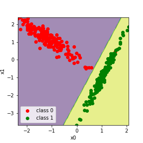

## SVM Linear Kernel
(Метод опорных векторов на линейном ядре)

Алгоритм для бинарной классификации, увеличивающий дистанцию между ближайшими к делительной плоскости наблюдениями.
Для этого используется функция потерь Hinge loss. В которой для верно классифицированных объектов градиент весов это веса, умноженные на коэффициент регуляризации и шаг обучения, а для неверно классифицированных объектов (margine < 1) градиент весов это выход линейной модели помноженый на целевую переменную (см. код).

В блокноте есть графики изменения весов. Пилообразность можно убрать уменьшив шаг обучения.

Также есть график результатов классификации, на котором можно видеть разделяющую плоскость, максимально удаленную от наблюдений.

Нелинейное ядро дико сложно программировать. Я не осилил.

